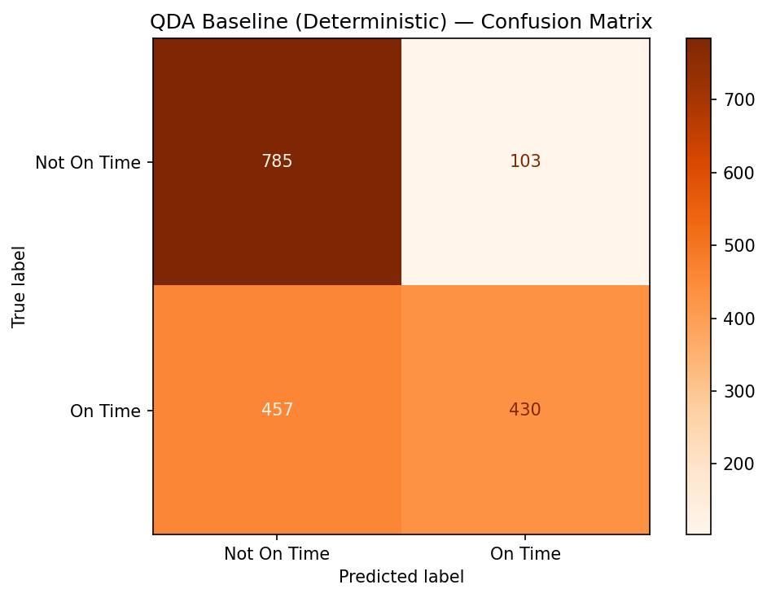
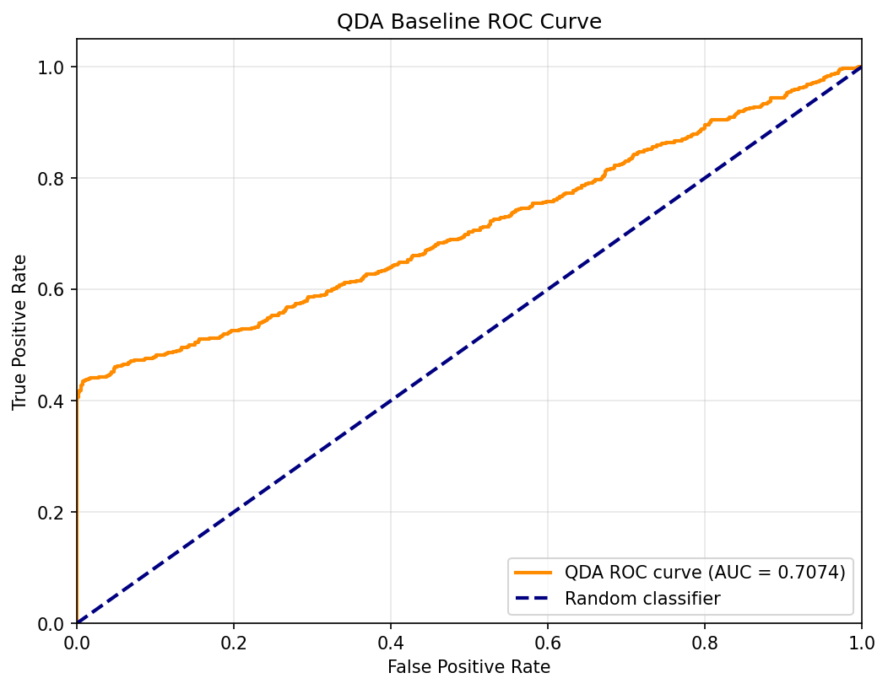

# QDA Baseline Report — On-Time Delivery Prediction

**Course:** STA 6636 — Large Data Analysis  
**Group 5:** Brandon Rodriguez, Gabriel Ruiz, Jorge Corcino, Ronaldo Martinez Frias  

---

## 1. Introduction

This report documents the application of Quadratic Discriminant Analysis (QDA) as a deterministic baseline to predict whether e-commerce shipments arrive on time. The target variable is `Reached.on.Time_Y.N`, a binary indicator where 1 denotes on-time delivery and 0 denotes late delivery. 

Establishing a QDA baseline allows us to evaluate the base accuracy achievable with generative models before moving towards the complexity and optimization requirements of discriminative models (such as SVMs). 

---

## 2. Dataset Description

| Feature               | Type      | Description                              |
|-----------------------|-----------|------------------------------------------|
| ID                    | Numerical | Unique customer identifier (dropped)     |
| Warehouse_block       | Nominal   | Warehouse block (A–F)                    |
| Mode_of_Shipment      | Nominal   | Shipment mode (Ship, Flight, Road)       |
| Customer_care_calls   | Numerical | Number of customer care calls            |
| Customer_rating       | Numerical | Customer satisfaction rating (1–5)       |
| Cost_of_the_Product   | Numerical | Product cost in USD                      |
| Prior_purchases       | Numerical | Number of prior purchases                |
| Product_importance    | Ordinal   | Importance level (Low, Medium, High)     |
| Gender                | Boolean   | Customer gender (M/F)                    |
| Discount_offered      | Numerical | Discount percentage offered              |
| Weight_in_gms         | Numerical | Product weight in grams                  |
| **Reached.on.Time_Y.N** | **Boolean** | **Target — on-time delivery (0/1)** |

---

## 3. Preprocessing

A standardized preprocessing pipeline is maintained across our deterministic baselines to ensure exactly equal evaluation comparisons against our primary SVM architecture:

1. **Missing Value Imputation**: Numeric columns imputed via the median; categorical columns via the mode.
2. **Outlier Clipping**: The IQR method applied to limit extreme boundary observations.
3. **Categorical Encoding**: Dummy variables for nominal identifiers and simple integer encodings for ordinals.
4. **Class Balancing**: Undersampling the majority class (on-time deliveries) matching the raw frequency of the late deliveries (4,437 per class).
5. **Train/Test Split**: Stratified 80/20 data split maintaining distributions across data frames.
6. **Feature Scaling**: Scaled using a `StandardScaler`, yielding unit variance numeric representations. 

---

## 4. Methodology

### 4.1 Model Selection
QDA models the likelihood of each class as a multivariate Gaussian distribution, allowing each class to have an independent and separate covariance matrix. It does not assume that all classes share the identical scaling properties as LDA does.

The classification rule maximizes the posterior probability based on the discriminant function:
$$ \delta_k(x) = -\frac{1}{2} (x - \mu_k)^T \Sigma_k^{-1} (x - \mu_k) - \frac{1}{2} \ln |\Sigma_k| + \ln \pi_k $$

We use the scikit-learn `QuadraticDiscriminantAnalysis()` module, utilizing default tracking parameters to solidify a strictly deterministic baseline without recursive optimization operations.

---

## 5. Results

*(Note: Run `shipping_qda.ipynb` locally and fill in your output numbers down below)*

### 5.1 Baseline Classification Performance

| Metric    | Class 0 (Late) | Class 1 (On Time) | Overall |
|-----------|---------------:|-----------------:|--------:|
| Precision | 0.63           | 0.81             | —       |
| Recall    | 0.88           | 0.48             | —       |
| F1-Score  | 0.74           | 0.61             | —       |
| **Accuracy** | —           | —                | **0.6845** |

### 5.2 Confusion Matrix (Baseline)

### 5.3 ROC Curve (Baseline)
*(Note: Expected AUC plot bounding the TPR and FPR probabilities computed with `predict_proba()`)*

---

## 6. Discussion and Conclusion

*Evaluating the results above, we can objectively measure the deterministic floor predictive capacity of our dataset.*

The QDA deterministic baseline achieved an accuracy of 68.45%. Similar to our SVM tests, the QDA heavily favors identifying late shipments (Class 0) accurately with an impressive recall of 0.88, while significantly struggling to accurately recall on-time deliveries (0.48). 

Ultimately, comparing this baseline performance to our best tuned SVM model (71.66% accuracy), we observe that the added analytical complexity of geometrically optimizing margins provides a tangible ~3.2% classification accuracy improvement over simpler generative distribution assumptions.
