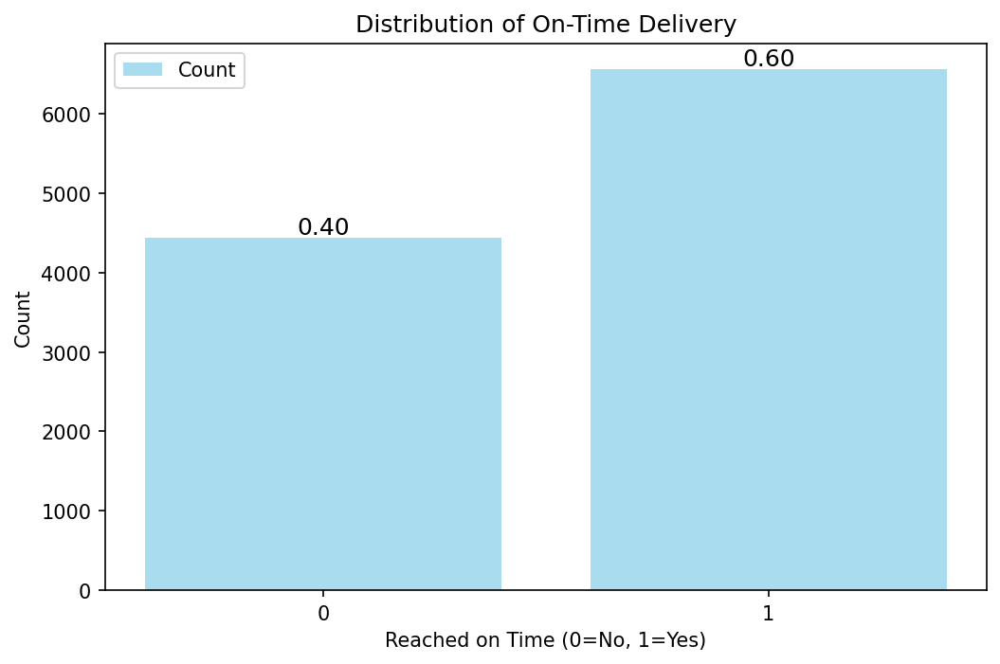
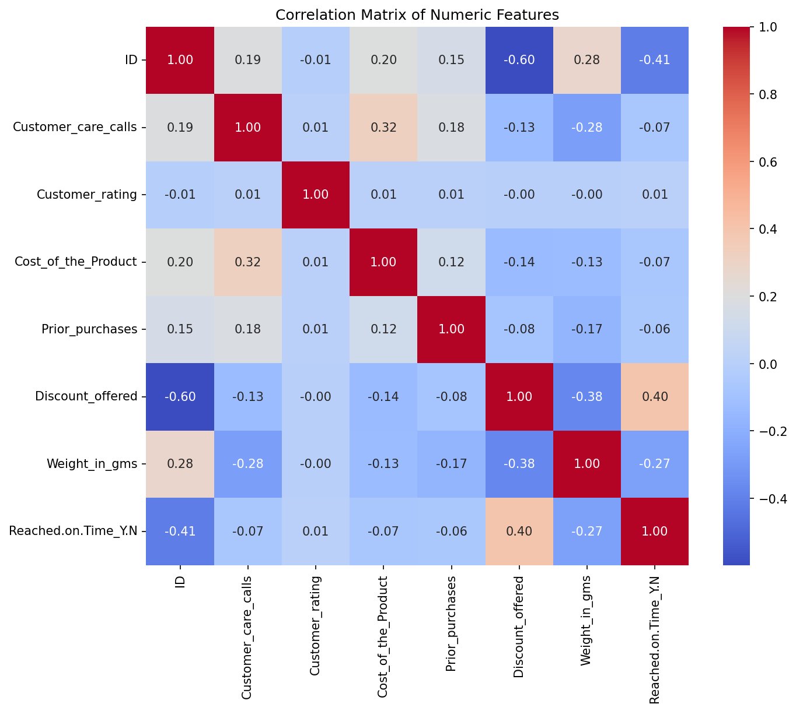
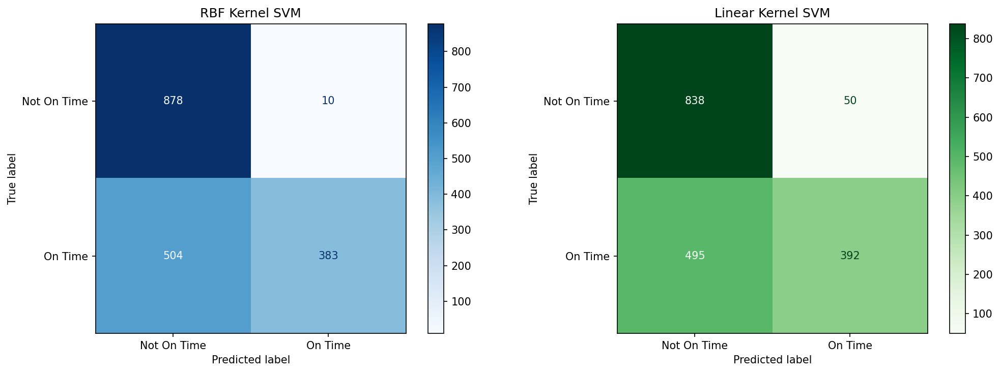
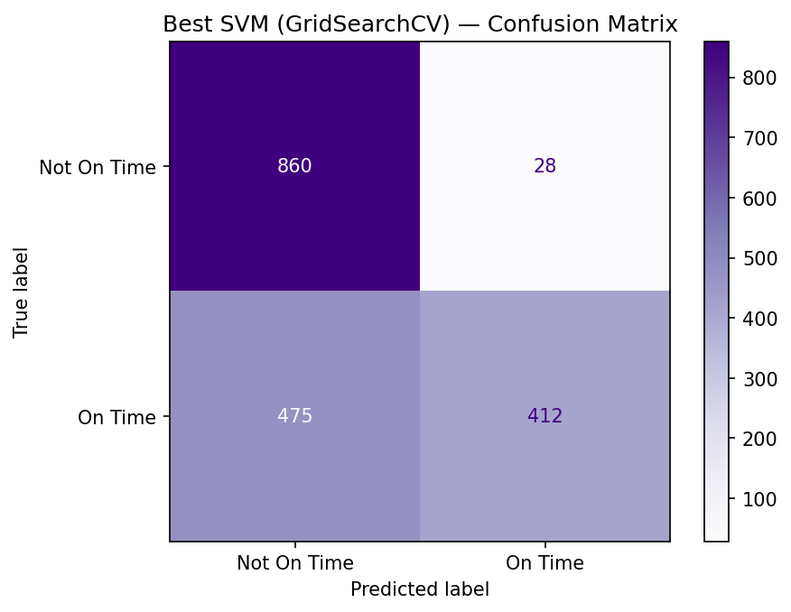
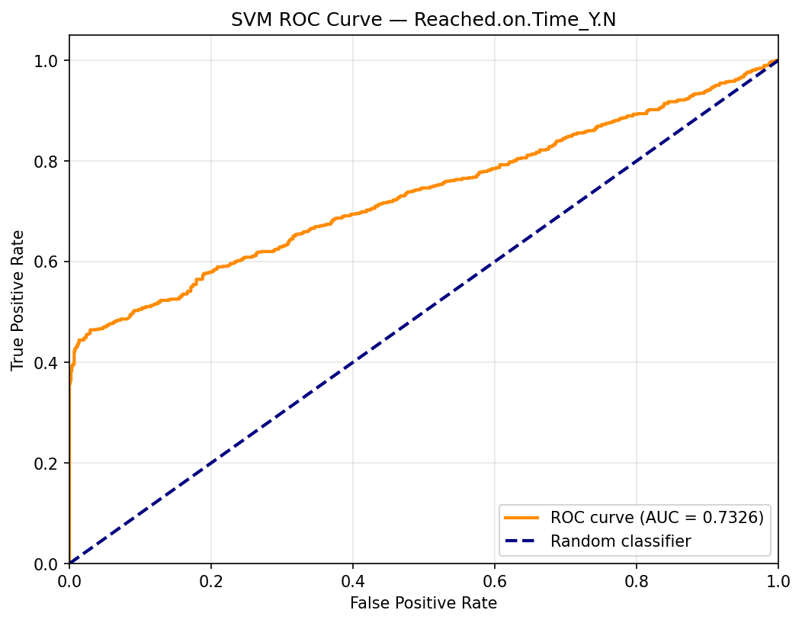

# SVM Classification Report — On-Time Delivery Prediction

**Course:** STA 6636 — Large Data Analysis  
**Group 5:** Brandon Rodriguez, Gabriel Ruiz, Jorge Corcino, Ronaldo Martinez Frias  

---

## 1. Introduction

This report documents the application of Support Vector Machine (SVM) classification to predict whether e-commerce shipments arrive on time. The target variable is `Reached.on.Time_Y.N`, a binary indicator where 1 denotes on-time delivery and 0 denotes late delivery. SVM was selected as one of several classification methods to evaluate predictive performance on this dataset, complementing the logistic regression and gradient boosting approaches outlined in our project proposal.

The dataset originates from an international e-commerce company specializing in electronic products and contains 10,999 records across 12 features covering warehouse logistics, shipment mode, customer demographics, product characteristics, and purchase history.

---

## 2. Dataset Description

| Feature               | Type      | Description                              |
|-----------------------|-----------|------------------------------------------|
| ID                    | Numerical | Unique customer identifier (dropped)     |
| Warehouse_block       | Nominal   | Warehouse block (A–F)                    |
| Mode_of_Shipment      | Nominal   | Shipment mode (Ship, Flight, Road)       |
| Customer_care_calls   | Numerical | Number of customer care calls            |
| Customer_rating       | Numerical | Customer satisfaction rating (1–5)       |
| Cost_of_the_Product   | Numerical | Product cost in USD                      |
| Prior_purchases       | Numerical | Number of prior purchases                |
| Product_importance    | Ordinal   | Importance level (Low, Medium, High)     |
| Gender                | Boolean   | Customer gender (M/F)                    |
| Discount_offered      | Numerical | Discount percentage offered              |
| Weight_in_gms         | Numerical | Product weight in grams                  |
| **Reached.on.Time_Y.N** | **Boolean** | **Target — on-time delivery (0/1)** |

The dataset contains no missing values. The raw target distribution is approximately 60% on-time (class 1) and 40% late (class 0), representing a mild class imbalance.

---

## 3. Exploratory Data Analysis

The correlation heatmap below shows relationships among numeric features. Notable observations:

- **Discount_offered** has the strongest positive correlation with on-time delivery (+0.40).
- **Weight_in_gms** has a notable negative correlation (−0.27), indicating heavier products are less likely to arrive on time.
- **Customer_rating** shows near-zero correlation (+0.01) with on-time delivery, suggesting customer satisfaction does not predict delivery timeliness.

---

## 4. Preprocessing

A standardized preprocessing pipeline was applied to ensure consistency across all classification methods used in this project:

1. **ID Removal**: The `ID` column was dropped as it is a unique identifier with no predictive value.

2. **Missing Value Imputation**: Numeric columns were imputed with the median; categorical columns were imputed with the mode. While the dataset contained no missing values, this step ensures robustness for future data.

3. **Outlier Clipping**: The IQR method was applied to four continuous features (`Customer_care_calls`, `Cost_of_the_Product`, `Discount_offered`, `Weight_in_gms`). Values beyond 1.5 × IQR from Q1/Q3 were clipped to the boundary values.

4. **Categorical Encoding**:
   - `Gender` was binary-encoded (M = 1, F = 0).
   - `Product_importance` was ordinal-encoded (Low = 0, Medium = 1, High = 2).
   - `Warehouse_block` and `Mode_of_Shipment` were one-hot encoded with `drop_first=True` to avoid multicollinearity.

5. **Class Balancing**: The majority class (on-time, class 1) was undersampled to match the minority class (late, class 0), resulting in a balanced dataset of 8,874 samples (4,437 per class).

6. **Feature Scaling**: A `StandardScaler` was fit on the training set and applied to both training and test sets. Only the five continuous numeric features were scaled (`Customer_care_calls`, `Cost_of_the_Product`, `Prior_purchases`, `Discount_offered`, `Weight_in_gms`). Feature scaling is critical for SVM because the algorithm relies on distances between data points; unscaled features with large ranges would dominate the decision boundary.

7. **Train/Test Split**: An 80/20 stratified split was used (random_state=42). Training set: 7,099 samples. Test set: 1,775 samples.

---

## 5. Methodology

### 5.1 Model Selection

Two SVM kernel functions were evaluated:

- **RBF (Radial Basis Function) Kernel**: A nonlinear kernel that maps data into a higher-dimensional space. Controlled by hyperparameters `C` (regularization) and `gamma` (kernel coefficient).

- **Linear Kernel**: Finds a linear hyperplane to separate the classes. Computationally less expensive and serves as a baseline.

### 5.2 Hyperparameter Tuning

A 5-fold cross-validated grid search (`GridSearchCV`) was performed over the following parameter space:

| Hyperparameter | Values Searched      |
|---------------|----------------------|
| `C`           | 0.1, 1, 10           |
| `gamma`       | `'scale'`, `'auto'`  |
| `kernel`      | `'rbf'`, `'linear'`  |

Total combinations evaluated: 12 candidates × 5 folds = 60 fits.

---

## 6. Results

### 6.1 RBF Kernel SVM (C=1.0, gamma='scale')

| Metric    | Class 0 (Late) | Class 1 (On Time) | Overall |
|-----------|---------------:|-----------------:|--------:|
| Precision | 0.64           | 0.97             | —       |
| Recall    | 0.99           | 0.43             | —       |
| F1-Score  | 0.77           | 0.60             | —       |
| **Accuracy** | —           | —                | **0.7104** |

### 6.2 Linear Kernel SVM (C=1.0)

| Metric    | Class 0 (Late) | Class 1 (On Time) | Overall |
|-----------|---------------:|-----------------:|--------:|
| Precision | 0.63           | 0.89             | —       |
| Recall    | 0.94           | 0.44             | —       |
| F1-Score  | 0.75           | 0.59             | —       |
| **Accuracy** | —           | —                | **0.6930** |

### 6.3 Confusion Matrices (RBF vs Linear)

### 6.4 Best Model (GridSearchCV)

The grid search identified the following optimal configuration:

| Hyperparameter | Best Value |
|---------------|------------|
| `C`           | 10         |
| `gamma`       | `'auto'`   |
| `kernel`      | `'rbf'`    |

**Best Cross-Validation Accuracy:** 0.7157

**Test Set Performance:**

| Metric    | Class 0 (Late) | Class 1 (On Time) | Overall |
|-----------|---------------:|-----------------:|--------:|
| Precision | 0.64           | 0.94             | —       |
| Recall    | 0.97           | 0.46             | —       |
| F1-Score  | 0.77           | 0.62             | —       |
| **Accuracy** | —           | —                | **0.7166** |

### 6.5 ROC Curve

The best-tuned SVM achieved an **AUC of 0.7326**, indicating moderate discriminative ability above random chance (AUC = 0.5).

### 6.6 Results Summary

| Model                                     | Test Accuracy | AUC    |
|-------------------------------------------|:------------:|:------:|
| SVM (RBF, C=1, gamma='scale')             | 0.7104       | —      |
| SVM (Linear, C=1)                         | 0.6930       | —      |
| **SVM (Best: C=10, gamma='auto', RBF)**   | **0.7166**   | **0.7326** |

---

## 7. Discussion

### 7.1 Model Behavior

All three SVM models exhibit a consistent pattern: high recall for class 0 (late deliveries) but lower recall for class 1 (on-time deliveries). This means the models are better at identifying late shipments than confirming on-time ones. The trade-off suggests that the decision boundary leans toward predicting "late," which results in many on-time shipments being misclassified.

### 7.2 Kernel Comparison

The RBF kernel outperformed the linear kernel by approximately 1.7 percentage points in accuracy (71.04% vs 69.30%), indicating that nonlinear relationships between features contribute to prediction quality. The tuned RBF model (C=10, gamma='auto') provided a further modest improvement to 71.66%.

### 7.3 Feature Insights

From the correlation analysis, `Discount_offered` and `Weight_in_gms` are the two most informative features for predicting delivery timeliness. The near-zero correlation of `Customer_rating` with the target confirms that customer satisfaction is largely independent of delivery performance.

---

## 8. Conclusion

SVM classification achieves approximately 71.7% accuracy and an AUC of 0.73 on the balanced e-commerce shipping dataset. The RBF kernel with C=10 and gamma='auto' was the best-performing configuration. While the model demonstrates reasonable discriminative ability, the moderate AUC suggests that SVM alone may not fully capture the complexity of on-time delivery prediction, and ensemble methods (e.g., Random Forest, XGBoost) may provide stronger performance.

---

## 9. References

- Cortes, C., & Vapnik, V. (1995). Support-vector networks. *Machine Learning*, 20(3), 273–297.
- Pedregosa, F., et al. (2011). Scikit-learn: Machine Learning in Python. *Journal of Machine Learning Research*, 12, 2825–2830.
- E-Commerce Shipping Dataset — Kaggle.
